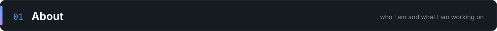
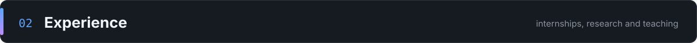
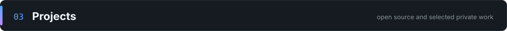
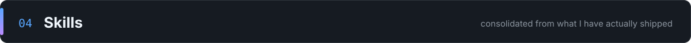
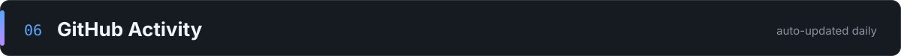

  

  &nbsp;
  &nbsp;
  &nbsp;
  

 

<table>
<tr>
<td width="60%" valign="top">

I am a Master's student in Computer Science at the **University of Colorado Boulder** (May 2027) and an **AI Engineer Intern at C-Suite Comp**, where I design and operate production data and LLM pipelines on Google Cloud.

I like problems that sit between machine learning and infrastructure: making retrieval systems fast and traceable, moving heavy compute off the request path, and putting guardrails and approval gates around agents so they can be trusted with real systems.

**Currently building:** an agentic incident-response platform that works an outage the way an on-call engineer does — triage, diagnose, verify, fix — and requires human approval before touching anything live.

</td>
<td width="40%" valign="top">

<table>
  <tr><td><b>Role</b></td><td>AI Engineer Intern, C-Suite Comp</td></tr>
  <tr><td><b>Education</b></td><td>M.S. CS, CU Boulder (GPA 3.72) B.E. IT, PICT Pune (8.23/10)</td></tr>
  <tr><td><b>Research</b></td><td>Patent co-author, 2 publications</td></tr>
  <tr><td><b>Impact</b></td><td>Data behind research cited by Bloomberg and CFO.com</td></tr>
  <tr><td><b>Location</b></td><td>Boulder, CO (remote-friendly)</td></tr>
  <tr><td><b>Contact</b></td><td><a href="mailto:adwaitd393@gmail.com">adwaitd393@gmail.com</a></td></tr>
</table>

</td>
</tr>
</table>

 

<table>
  <tr>
    <th align="left" width="24%">Role</th>
    <th align="left" width="18%">Period</th>
    <th align="left">What I did</th>
  </tr>
  <tr>
    <td><b>AI Engineer Intern</b> C-Suite Comp · Houston, TX (remote)</td>
    <td>Jul 2026 – Present</td>
    <td>
      Built and operate 4 production data and LLM pipelines on GCP (Cloud Run, Scheduler, Cloud Build, Secret Manager, Pub/Sub) over <b>609K+ SEC filings across 4,850+ companies</b>. 
      Rebuilt the RAG document-search to answer across 10–30 companies at once: a 20-company build went from <b>15 min to 3</b>, request latency from <b>108 s to 18.5 s</b>, repeat loads under 1 s via cached FAISS indexes that merge in 0.01 s. 
      Designed sharded, checkpointed, idempotent processing with distributed locking on Cloud Storage; cut projected annual AI cost from <b>~$20K to $75</b>. The resulting dataset underpins research cited by Bloomberg and CFO.com.
    </td>
  </tr>
  <tr>
    <td><b>Graduate Research Assistant</b> Quantitative ML · CU Boulder</td>
    <td>May 2026 – Aug 2026</td>
    <td>
      Built a dividend-announcement forecasting system over <b>340+ companies and 50K+ records</b> (LightGBM ranking, ensembles, calibrated hazard models): <b>83%</b> date accuracy, <b>91%</b> precision on rare events, 15+ pts over the best classical baseline. 
      Separated offline computation from serving with versioned artifacts and statistically gated releases; built the React research dashboard on top.
    </td>
  </tr>
  <tr>
    <td><b>Graduate Teaching Assistant</b> Remote Sensing Data Analysis · CU Boulder</td>
    <td>Aug 2026 – Present</td>
    <td>Help 100+ students debug Python/MATLAB implementations of 10+ ML algorithms (PCA, clustering, SVMs, random forests, neural networks) across 6 course modules; review code and run technical interviews for project work.</td>
  </tr>
  <tr>
    <td><b>Full Stack Engineer Intern</b> Techpeek · Bengaluru, India</td>
    <td>Sep 2024 – Jan 2025</td>
    <td>
      Built the billing, usage-metering and LLM-gateway backend for a 3-tier AI subscription product: 25+ REST endpoints, idempotent webhook-driven payments (<b>10,000 replayed events, zero duplicate transitions</b>, 50+ integration tests), semantic caching and model routing that cut repeat model calls 30%+. 
      Load-tested at <b>300+ req/s under 200 ms p95</b>; Redis caching took hot-path latency from 400 ms to 120 ms. Shipped the Svelte front end for the same flows.
    </td>
  </tr>
</table>

 

<table>
  <tr>
    <td width="50%" valign="top">
      <h3>Distributed Data Drift Detection Platform</h3>
      
 

      
Event-driven MLOps platform with a 5-service architecture (API, workers, message broker, object storage, dashboard) that runs four drift detectors per dataset: <b>semantic, lexical, topic and out-of-distribution</b>. Uploads return immediately; background workers compute transformer embeddings, persist metrics to Postgres, and raise alerts with retries, idempotency and dead-letter queues.

      

        
        
        
        
        
        
      

    </td>
    <td width="50%" valign="top">
      <h3>Music Separation as a Service</h3>
      
 

      
Distributed audio-processing backend on <b>Kubernetes / GKE</b> that splits songs into four stems with Meta's Demucs. Jobs run 3–4x the audio duration, so they are pushed through Redis queues to worker containers and results land in MinIO; API, queue, storage and model workers scale independently. Instrumented CPU, memory, queue depth, latency and failure rate with Prometheus and Grafana.

      

        
        
        
        
        
        
      

    </td>
  </tr>
  <tr>
    <td width="50%" valign="top">
      <h3>Agentic AI Incident Response Platform</h3>
      
 

      
An on-call copilot. An Alertmanager webhook lands in FastAPI and a <b>LangGraph</b> state machine works the incident in four stages — triage, diagnose, verify, fix — reading logs, metrics, Kubernetes state, deployment history and runbooks, ranking root-cause hypotheses against real evidence, and proposing a remediation that runs only after <b>explicit human approval</b>. Then it verifies recovery and writes the post-mortem.

      

        
        
        
        
        
      

    </td>
    <td width="50%" valign="top">
      <h3>Multi-Agent Financial Research System</h3>
      
 

      
Four cooperating agents research a company end to end: a planner, an evidence-gatherer wired to 8+ tools (SEC filings, market data, financial APIs), an analyst, and a fact-checker. Against a single-agent baseline on 100+ research questions it completed <b>87% of tasks (+15 pts)</b> with <b>95% of claims backed by a source citation</b>.

      

        
        
        
        
        
      

    </td>
  </tr>
  <tr>
    <td width="50%" valign="top">
      <h3>AI Resume Screening and Candidate Matching</h3>
      
 

      
Multi-stage matcher over <b>5M+ candidate–job interactions and 100K+ postings</b>: two-tower embedding retrieval with FAISS narrows the pool by 99.9% while keeping 97% of true matches in the top 100, then LightGBM reranks on 30+ behavioral, contextual and profile features (<b>+18% NDCG@10</b> over baselines). Served under 80 ms p95 at 1,000+ req/s via FastAPI, Redis and precomputed embeddings.

      

        
        
        
        
        
      

    </td>
    <td width="50%" valign="top">
      <h3>Network Protocol Regression and Failure-Validation Platform</h3>
      
 

      
A routing testbed of <b>20+ containerized routers</b> implementing OSPF-style link-state routing, neighbor discovery, topology flooding and automatic recomputation, validated by 100+ PyTest/Scapy regression tests and 50+ injected link and node failures. An Angular + RxJS + WebSockets dashboard renders the live topology and replaces CLI setup for failure scenarios with one or two clicks.

      

        
        
        
        
        
      

    </td>
  </tr>
  <tr>
    <td width="50%" valign="top">
      <h3>Automated Cloud Infrastructure Deployment</h3>
      

      
Google Cloud automation through the Compute Engine Python API: provisions a VM, installs an app from git, opens firewall rules, snapshots the VM into a reusable image, benchmarks cold-start across instances, and uses IAM service accounts so a VM can create further VMs.

      

        
        
        
      

    </td>
    <td width="50%" valign="top">
      <h3>Next Play — Kanban Task Board</h3>
      

      
Linear-style board with drag-and-drop columns, priorities, due dates and overdue indicators. Anonymous guest auth with per-user isolation through <b>Supabase Row Level Security</b>; responsive from 320 px to ultrawide with dark and light modes.

      

        
        
        
        
      

    </td>
  </tr>
</table>

Also on GitHub: <a href="https://github.com/adwait39/Elite-Estate">Elite Estate</a> (MERN real-estate marketplace) · <a href="https://github.com/adwait39/evenza">Evenza</a> (Angular)

 

  

<table>
  <tr>
    <td width="25%" valign="top"><b>LLM and Agentic AI</b> RAG · multi-agent orchestration · tool calling · MCP · structured outputs · guardrails and approval gates · semantic caching · model routing · LLM inference gateways · LLM-as-a-Judge · human-agreement scoring · regression testing for LLM systems</td>
    <td width="25%" valign="top"><b>Retrieval and ML</b> FAISS · BM25 · dense embeddings · hybrid retrieval · reranking · chunking strategy · deduplication and data-quality gates · LightGBM · ensembles and ranking models · calibrated probabilities · hazard modeling · time-aware validation · feature ablation · PyTorch · scikit-learn · Pandas · NumPy</td>
    <td width="25%" valign="top"><b>Backend and Data</b> Python · TypeScript · Java · C++ · Go · SQL · FastAPI · Flask · Django · Node.js · Express · REST · webhooks · auth · rate limiting · idempotency · pagination · PostgreSQL · MongoDB Atlas · Redis · MinIO · RabbitMQ · Google Pub/Sub · worker queues · event-driven architecture · query batching</td>
    <td width="25%" valign="top"><b>Cloud, DevOps and Frontend</b> GCP (Cloud Run, Scheduler, Cloud Build, Artifact Registry, Secret Manager, VPC) · AWS · Docker · Kubernetes / GKE · Terraform · CI/CD · autoscaling · distributed locking · checkpointing · dead-letter queues · OpenTelemetry · Prometheus · Grafana · React · Angular · Svelte/SvelteKit · Redux Toolkit · RxJS · WebSockets · Tailwind · PyTest · Playwright · React Testing Library · load testing · fault injection</td>
  </tr>
</table>

 

<table>
  <tr>
    <td width="50%" valign="top">
      <b>Patent</b> — co-author of patented research on NLP and information-retrieval systems, filed by the sponsoring company and shipped as a live commercial product.  
      <b>Publications</b> — two international publications: <i>Journal of Scientific Computing</i> and <i>Delving Deeper into Semantic Web and Ontologies</i>.  
      <b>Research impact</b> — built the data infrastructure behind executive-compensation research cited by <b>Bloomberg</b> and <b>CFO.com</b>.
    </td>
    <td width="50%" valign="top">
      <b>Competitions</b> — Top 10, AWS GameDay (Feb 2026) · 3rd place, PICT Hackathon (Mar 2025) · Finalist, PICT poster competition.  
      <b>Teaching</b> — Course Assistant, MCEN 3030 at CU Boulder (200+ students) · ML instructor for 80+ juniors at PICT · Graduate TA, Remote Sensing Data Analysis.  
      <b>Education</b> — M.S. Computer Science, University of Colorado Boulder, 2025–2027 (GPA 3.72) · B.E. Information Technology, Pune Institute of Computer Technology, 2021–2025 (8.23/10).
    </td>
  </tr>
</table>

 

  

  
  
  

  

 

  

