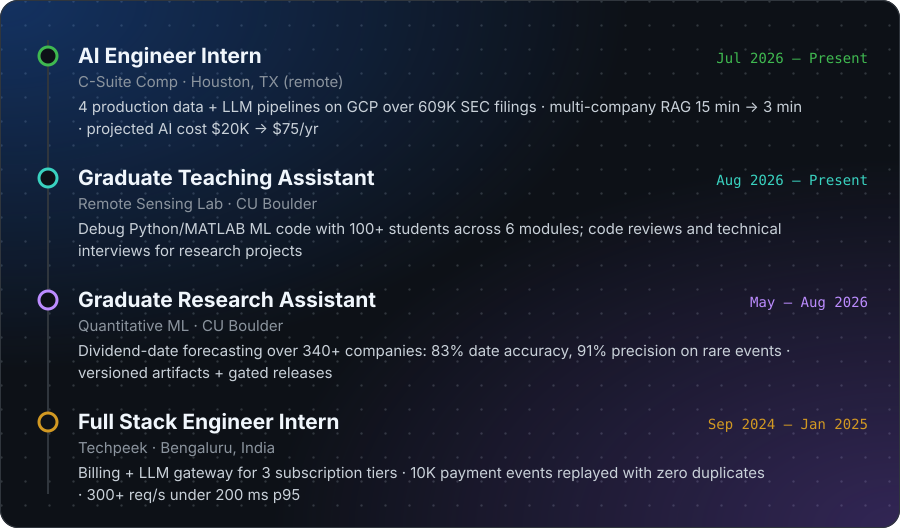
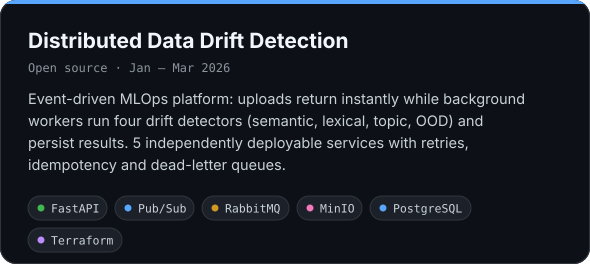
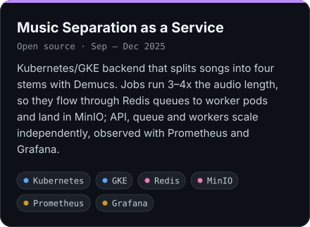
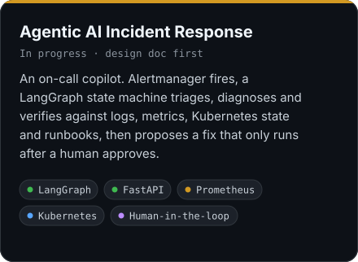
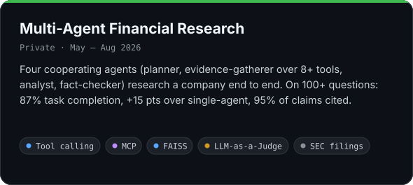
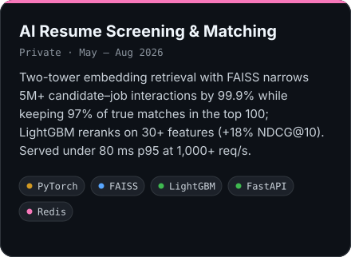
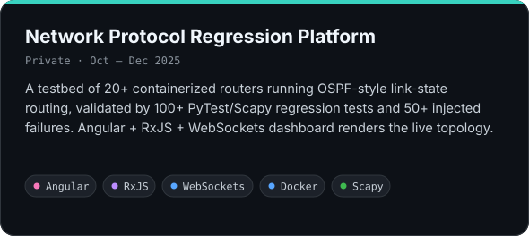
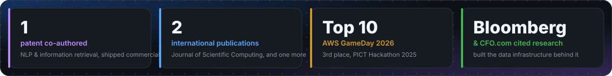
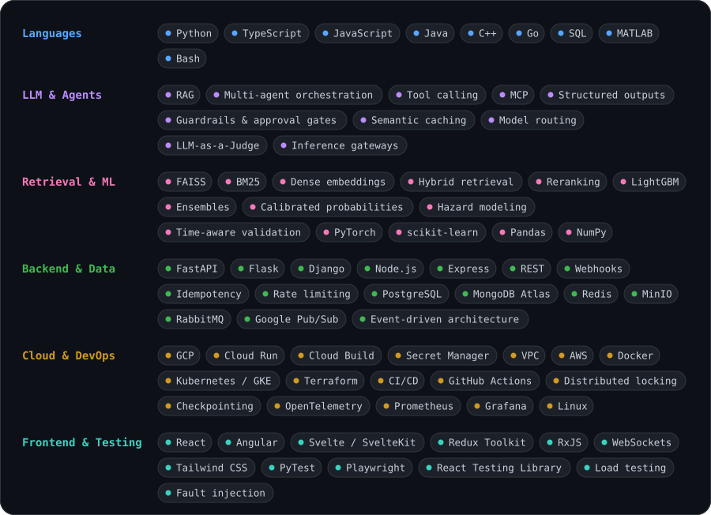

  

  &nbsp;
  &nbsp;
  &nbsp;
  

  M.S. Computer Science at CU Boulder and AI Engineer Intern at C-Suite Comp. I build the layer between machine learning and infrastructure: retrieval systems that stay fast and traceable, event-driven pipelines that keep heavy compute off the request path, and agents with guardrails and approval gates so they can be trusted with real systems.

 

<h3 align="center">Experience</h3>

  

 

<h3 align="center">Projects</h3>

  
  

  
  

  
  

  More on GitHub:
  <a href="https://github.com/adwait39/automated-cloud-infra-deployment">GCP infrastructure automation</a> ·
  <a href="https://github.com/adwait39/next-play">Next Play kanban board</a> ·
  <a href="https://github.com/adwait39/Elite-Estate">Elite Estate (MERN)</a>

 

<h3 align="center">Highlights</h3>

  

 

<h3 align="center">Skills</h3>

  

  

 

<h3 align="center">GitHub</h3>

  

  
  
  

  

 

  

